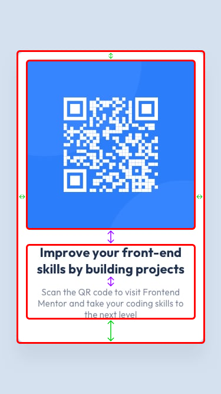

# Frontend Mentor - QR code component solution

This is a solution to the [QR code component challenge on Frontend Mentor](https://www.frontendmentor.io/challenges/qr-code-component-iux_sIO_H). Frontend Mentor challenges help you improve your coding skills by building realistic projects. 

## Table of contents

- [Overview](#overview)
  - [Screenshot](#screenshot)
  - [Links](#links)
- [My process](#my-process)
  - [Built with](#built-with)
  - [What I learned](#what-i-learned)
  - [Continued development](#continued-development)
  - [Useful resources](#useful-resources)
- [Author](#author)

**Note: Delete this note and update the table of contents based on what sections you keep.**

## Overview

### Screenshot

### Links

- Live Site URL: [Add live site URL here](https://albin0825.github.io/FrontendMentor/qr-code-component-main/)

## My process
- I first checked to see whether the layout differed between mobile and desktop, but they did not.
- I next considered what items I required and discovered that I required a box with an image, a header, and a paragraph.
- Then I noticed that there was space on the box, between the image and the text, and between the header and the paragraph.
- I put the header and paragraph in a box, so there should be a `gap` in between the image and the text, as well as a `gap` in between the header and the paragraph.
- Then I noticed that the text did not line up perfectly with the reference image, so I added `letter-spacing`, but the text was still not perfectly aligned but was closer enough to the original.

### Built with

- HTML5
- CSS
- Flexbox
- CSS Grid
- Mobile-first workflow
- [React](https://reactjs.org/) - JS library
- [Tailwind CSS](https://tailwindcss.com/) - CSS framework

### What I learned

I have improved my [markdown](https://docs.github.com/en/get-started/writing-on-github/getting-started-with-writing-and-formatting-on-github/basic-writing-and-formatting-syntax) skills, and I learned that I can preview my Markdown documents in Visual Studio Code, eliminating the need to upload them to GitHub to see their formatting.

### Continued development

I do not know if there is anything i particular i want to get better at, i thought this challenge was pretty easy

### Useful resources

- I did not use any resources on this one, everything came from memory 😄

## Author

- Website - [Phadonia](https://www.phadonia.com/)
- Frontend Mentor - [@Albin0825](https://www.frontendmentor.io/profile/Albin0825)
- Discord - [etsi0](https://discordapp.com/users/850433812089012335)